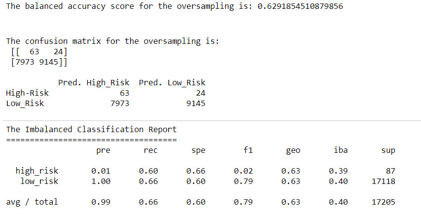
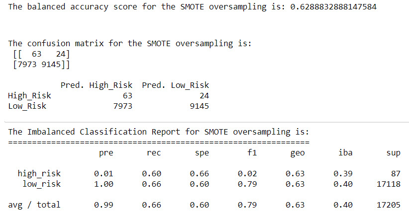
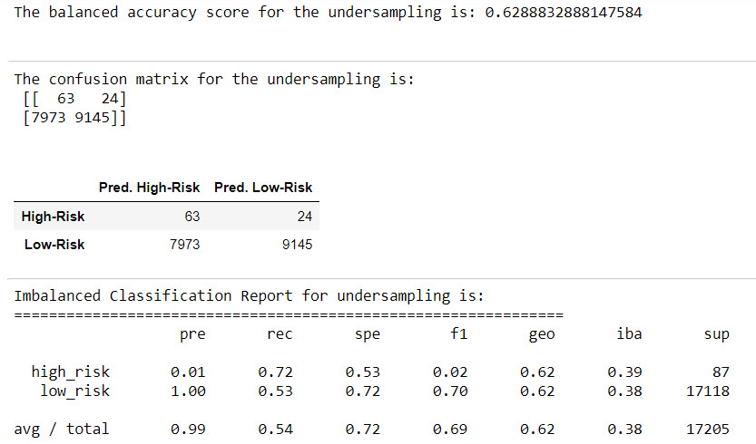
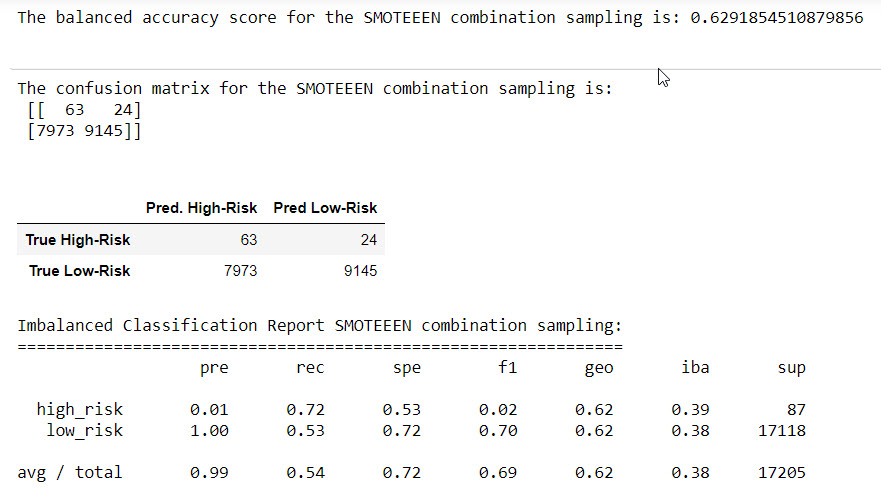
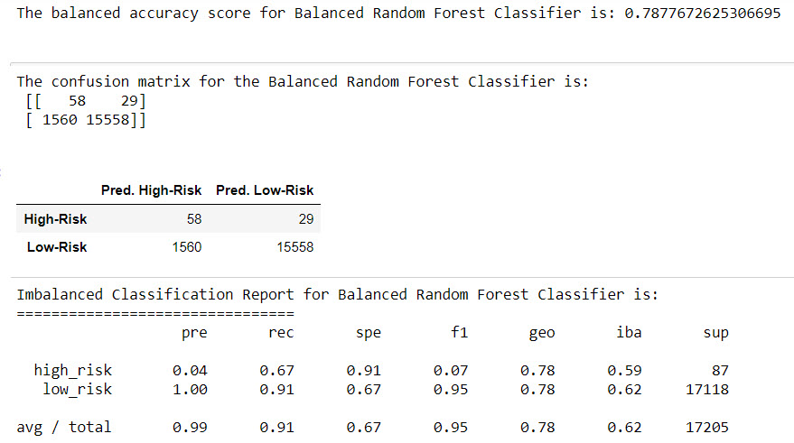
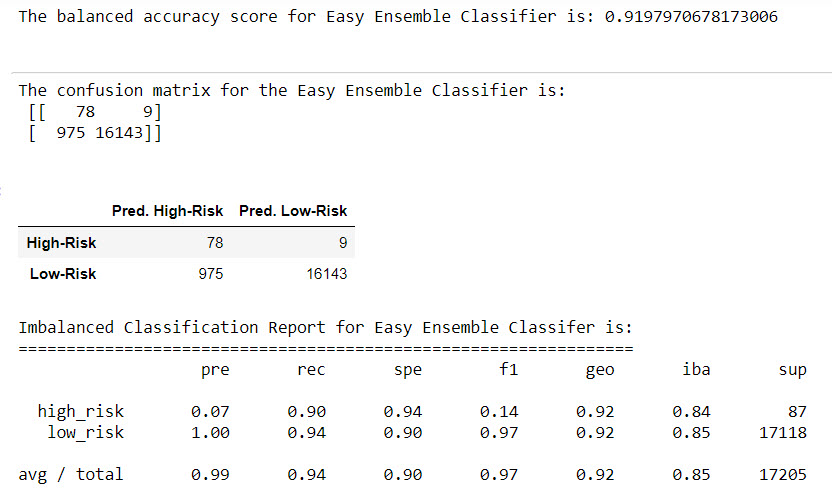

# Credit_Risk_Analysis

# Overview
_____________________________________________________________________
Utilize various methods to train and evaluate models with unbalanced classes using imbalanced-learn and scikit-learn libraries to build and evaluate models using resampling.

The credit card credit dataset from LendingClub was used in the analysis. 

The analysis has several deliverables.

•	Oversample the data using the RandomOverSampler and SMOTE algorithms

•	Undersample the data using the ClusterCenroids algorithm.

•	Use a combinatorial approach of over- and undersampling using the SMOTEENN algorithm.

•	Compare two new machine learning models that reduce bias, BalancedRandomForestClassifier and EasyEnsembleClassifer, to predict credit risk. 

•	Evaluate the performance of these models and make a written recommendation on whether they should be used to predict credit risk.

# Results 
___________________________________________________________________________________
 ## Naive Random Oversampling
 
Random oversampling involves randomly selecting examples from the minority class, with replacement, and adding them to the training dataset. 

**Balanced Accuracy Scores**

The balanced accuracy is ((sensitivity + specificity)/2)
 ((.60+.66)/2) = .63 
 
**Precision Scores**

The precision score is 0.01

**Recall Scores**

The recall score is .60 (high_risk rec)

### **Oversampling Summary**

## SMOTE Oversampling

SMOTE works by selecting examples that are close in the feature space, drawing a line between the examples in the feature space and drawing a new sample at a point along that line

**Balanced Accuracy Scores**

Balanced Accuracy = .63

**Precision Scores**

The precision score is 0.01

**Recall Scores**

The recall score is .60

### **SMOTE Summary**

## Undersampling

Undersampling involves randomly selecting examples from the majority class and deleting them from the training dataset.

**Balanced Accuracy Scores**

Balanced Accuracy = .63

**Precision Scores**

The precision score is 0.01

**Recall Scores**

The recall score is .72

### **Undersampling Summary**

## Combination (Over and Under) Sampling

Combining over- and undersampling to obtain better results. 

**Balanced Accuracy Scores**

Balanced Accuracy = .63

**Precision Scores**

The precision score is 0.01

**Recall Scores**

The recall score is .72

### **Combo Sampling Summary**

## Balanced Random Forest Classifier

 A balanced random forest randomly under-samples each  sample to balance it.
 
**Balanced Accuracy Scores**

Balanced Accuracy = .79

**Precision Scores**

The precision score is 0.04

**Recall Scores**

The recall score is .67

### **Random Forest Classifier Summary**

## Easy Ensemble AdaBoost Classifier

Aa meta-estimator that begins by fitting a classifier on the original dataset and then fits additional copies of the classifier on the same dataset but where the weights of incorrectly classified instances are adjusted such that subsequent classifiers focus more on difficult cases.

**Balanced Accuracy Scores**

Balanced Accuracy = .92

**Precision Scores**

The precision score is 0.07

**Recall Scores**

The recall score is .90

### **Ensemble Classifier Summary**

# Summary
The results of this analysis show that the ensemble model produce better outcomes than the resampling classifiers. The ensemble models were more accurate at identifying loan risk. Looking at the accuracy scores of the ensemble model, which produced the best results at 92%, the precision score was only 7%. This means that only 7% of the results were true positives. 

The other models ranged in accuracy scores from 63-79%

The precision scores ranged from 1-4%

The recall scores ranged from 60-72%

As a result of the high number of risky loans that are missed in the models, none of the models are recommended to predict credit risks.
